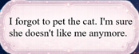

# Bug Log - Project: Psyche

### Symbols used:
- 🐛 bug
- 🔍 cause / examine
- 🔧 fix
- 💡 idea
- 👀 thing to watch
- ⚠️ warning / careful
- ✅ correct
- ❌ wrong

## 2026-06-20
### **`CSS`** - Clouds overflow

- **🐛:** Text extends beyond the cloud image
<br></br>

- **🔍:** font-size too big for cloud max-width
- **🔧:** Reduced font-size + added maxlength to input in thoughts.html + fixed image shape!
<br></br>

- **💡:** font-size, text width, and image size all have to agree. When text overflows, sometimes the fix is a better-shaped img, not more CSS.
---

### **`JS`** - Uncaught ReferenceError: thoughtText is not defined

- **🐛:** No Cloud is appearing after hitting enter


- **🔍:** not defined: mismatched variable name → code below will never run → no clouds apear after hitting enter!

- **🔧:** match the names
```js
// Text create
const thoughtTextCloud = document.createElement("span");
thoughtTextCloud.classList.add("thought-text");
thoughtTextCloud.textContent = thoughtInput.value;
```
- **💡:** "not defined" = the variable name doesn't exist (usually a typo or mismatched name). Different from "null" = the element wasn't found on the page.

## 2026-06-21
### **`CSS`** - `doneButton` apears after pressing any key.
- **🐛:** `doneButton` is created after pressing any button
- **🔍:** the `else`❌ ran on *every* non-Enter keypress → button appeared immediately, not after 4 clouds.
- **🔧:** Use if instead to specify the action. `if (inputCounter === 4)✅ `
- **💡:** `else` triggers on ALL false cases. For independent checks, use a separate `if`
---
### **`CSS`** - `doneButton` and input field are not adjusted
- **🐛:** `doneButton` pushes the input field to the left.


- **🔍** all got `display: flex;` but no one got something like `position: absolute;`
- **🔧:** using `position: absolute;` at `doneButton`.
- **💡:** `position: absolute;` on `doneButton` → not part of `display: flex;` anymore → now adjust the rest.


---

### **`CSS`** - adjusted boxes have erratic behavior despite the settings
- **🐛:** Clouds are above the input field.
- **🔍:** `display: flex;`-configs manipulate uncontrolled
- **🔧:** use `border: _px solid _rgb` to understand the positions → fix.
<br></br>

- **💡:** `display: flex` → `justify-content` and `align-items`, use `top`, `bottom`, `right`, `left`

---

### **`CSS`** - `background` shorthand wipes my settings

- **🐛:** Background stopped using `cover` image showed at wrong size.
- **🔍:** `background: url(...)` is shorthand → it silently resets `background-size` `-position`, `-repeat` to defaults.
- **🔧:** `background: url(...)` ❌ → `background-image: url(...)` ✅ 
- **💡** A shorthand resets every sub-property it covers, even ones you didn't write. Using long-hand to keep other settings.

---

### **`HTML`** - screen background only works when id is on `<body>`

- **🐛:** Have to repeat the background settings on every screen, it never worked from `body` alone.
- **🔍:** My `id="screen-1-home"` is defined in a separate `<div>`, not in the `body`.
- **🔧:** `<div id="screen-1-home">`❌ `<body id="screen-1-home">`✅
- **💡:** background doesn't inherit, setting it on `body` won't automatically apply to a CHILD-`<div>` the CHILDren would need its own background. Putting the `id` on `<body>` means body itself carries the image, so it fills the viewport.

## 2026-06-22

### **`CSS`** - `bottom: 50%` does nothing

* 🐛: move `#info-text` up with `bottom: 50%` → nothing happened
* 🔍: `%` in `top`/`bottom`/`height` is measured against the PARENTs's size. `#row` had no height set → 50% of (basically) 0 is still 0.
* 🔧: `bottom: 50%` ❌ → `bottom: 50px` ✅ fixed value, ignores PARENT (or give PARENT height so the % has something to measure against)
* 💡: When a `%` value "does nothing", first question: what's the PARENT, and does it have a size? Same trap bites `height: 100%`.
---
### **`CSS`** - mystery gap under `#info-text` (`<p>`)

* 🐛: A gap stayed under the info text even with `align-items: flex-end` on the row. Bottom edges wouldn't line up.
* 🔍: Browsers give `<p>` a default `margin-top`/`margin-bottom` I never wrote. That invisible bottom margin pushed it up off the flex-end line.
* 🔧: Added `margin: 0;` to `#info-text` → gap gone.
* 💡: Spacing "out of nowhere" = suspect default browser styles first. `margin: 0` overrieds the browser's hidden default.
---
### **`CSS`** - lining up bottom edges in a flex row

- **🐛**: `#info-text`, input, and done-button wouldn't sit on the same bottom line.
- **🔍**: `align-items: center` was centering them; also the tallest CHILD (done-button, 220px) silently defines the row height, so shorter CHILDren get margin gaps.
- **🔧**: `align-items: flex-end;` on `#row` → all CHILDren align bottoms. (`align-self: flex-end` does it for ONE CHILD only.)
- **💡**: In flexbox the tallest CHILD sets the line height; alignment is measured against that line.
---
### **`CSS`** - overlay pinned to the wrong place (top-left of page)

- **🐛**: The `::after` shine appeared in the top-left corner of the whole page instead of on the box.
- **🔍**: `position: absolute` pins to the nearest PARENT that has `position: relative`. The box had none → shine anchored to the whole page.
- **🔧**: PARENT `#thought-counter` → `position: relative` + `overflow: hidden`. CHILD `::after` → `position: absolute; top:0; left:0; width:100%; height:100%`.
- **💡**: The overlay pattern = anchor + fill. PARENT `relative` and CHILD `absolute` + `0/0/100%/100%` covered `100%`.
- **👀**: `::after` needs `content: "";` or the layer doesn't exist at all.
---
### **`JS`** - null crash loops forever

- **🐛**: On index.html the console spams the same error hundreds of times (252+), never stops.
- **🔍**: script.js is shared across both pages. The typewriter code uses `thoughtInput`, but the input box only exists on thoughts.html. On index.html `thoughtInput` = null. That line lives inside a `setInterval(..., 120)` → it retries every 120ms forever → the null crash repeats infinitely.
- **🔧**: Wrapped the whole typewriter block in `if (thoughtInput) { ... }` so it's skipped entirely when the input doesn't exist on the page.
- **💡**: A bug inside a repeating timer (`setInterval`) repeats WITH the timer → one mistake becomes infinite spam.
- **👀**: When shared JS runs on multiple pages, guard every block that touches a page-specific element with `if (element) { ... }`. An element missing on one page = null = crash there.
---
### **`ENV`** - file:// security errors & caching weirdness

- **🐛**: "Unsafe attempt to load URL... file: URLs are unique security origins" + "content not cached", when open index.html directly.
- **🔍**: Opening files by double-click runs them as file:// → browser reports...
- **🔧**: Run a local server (Live Server in VS Code → "Go Live") → pages load over http:// instead.
- **💡**: file:// = isolated/locked-down. Not a code bug — an environment thing. 

## 2026-06-24
### **`JV`** - `addEventListener` is not a function

- **🐛**: clicking a button threw `Uncaught TypeError: homeButton.addEventListener is not a function`
- **🔍**: I'd switched to `getElementsByClassName` → returns a list (collection), not one element. A list has no .addEventListener. In addition `if (homeButton)` still passed because an empty collection is truthy.
- **🔧**: `getElementsByClassName("home-button")` ❌ → `querySelector(".home-button")` ✅ (one element), or loop the collection to add a listener to each
- **💡**: `getElementById` → one element. `getElementsByClassName` / `querySelectorAll` → a list. Lists don't have element methods, and a list can still fool an if check.

---

### **`CSS`** - `height: 80%` does nothing on a div

- **🐛**: `height: 80%` on `#cloud-store` was ignored completely
- **🔍**: `%` height is measured against the PARENT's height. But `div`, `body`, `html` all default to `height: auto` → 80% of nothing = nothing. 
- **🔧**: build the chain from the top → `html, body { height: 100%; }`, `html` is the special link, its 100% measures against the viewport, then height flows down html → body → child
- **💡**: percentage heights need an unbroken chain of real heights all the way up to `<html>`. `html` is the one that touches the screen.

## 2026-06-27
### **`JS`** - Cannot read properties of null (reading `appendChild`)

- **🐛**: Crash on emotions.html when rebuilding clouds.


- **🔍**: `thoughtsContainer` is null, because it only exists on thoughts.html → Cannot read `appendChild` of null
```JS 
const thoughtsContainer = document.getElementById("thoughts-container");
```
- **🔧**: Pass container in as a parameter so the caller decides where:
```JS
function createFloatingClouds(input, container) {
  ...
  container.appendChild(divClouds); // whoever calls decides where
}

createFloatingClouds(thoughtInput.value, thoughtsContainer);                      // thoughts page
createFloatingClouds(thoughtsArray[thoughtsNumber], thoughtsCollectedContainer);  // emotions page
```
- **💡**: `Cannot read properties of null` almost always means an element wasn't found 

## 2026-06-28
### **`JS`** - Sparkle particles stacked +20 in every Enter

- **🐛**: Hovering the readyButton spawned more and more particles each time I pressed Enter → +20, +40, +60...


- **🔍**: `sparkleEffect()` was called inside `keydown`, in the `if (inputCounter === MAX_THOUGHTS)` block. Once the counter hit MAX, that block stayed true, so every following Enter ran `sparkleEffect()` again, and each call adds a NEW `mouseenter` listener. More listeners = more intervals = stacking particles.
- **🔧**: Created a flag `sparkleEffectSwitch = true;` which changes to `sparkleEffectSwitch = false;` after `sparkleEffect()` was called OR just load it once in init() (then no risk to manage, maybe better one) BUT it's much more code an more complicated!
- **💡**: `if`-guard stops code from running, but it doesn't fix code that's in the wrong place, IMPORTANT: load = setup once. event = respond every time. flag = do once, then never again. I chose flag, because it only adds 2 lines and it's task is very clear and good readable!

---

### **`JS`** - Only 1 of 4 clouds appeared on `emotions.html`
- **🐛**: Recreating clouds from localStorage, only the first cloud showed.
- **🔍**: `createFloatingClouds` had no `return divClouds;`, so `const cloud = ...` was `undefined`, and `undefined.addEventListener()` CRASHED the script → loop died after cloud 1.
- **🔧**: Added `return divClouds;` as the LAST line of `createFloatingClouds` (after appendChild). Caught it in the loop with `const cloud = ...`, then added the listener to `cloud`.
- **💡**: `return` = the function hands a VALUE back to whoever called it (the caller catches it in a variable). It must be the last line, nothing after it runs. No return + someone uses the result = `undefined` crash.

---

### **`JS`** - Dragged cloud jumped — mouse stuck to top-left corner

- **🐛**: When I grabbed a cloud anywhere except its corner, it teleported so its top-left corner snapped under my mouse.
- **🔍**: `activeCloud.style.left = event.clientX + "px"` and `activeCloud.style.top = event.clientY + "px"` puts the cloud's CORNER at the mouse. So grabbing the middle made the corner jump to the cursor.

- **🔧**: On mousedown, measure how far INSIDE the cloud I clicked, using`getBoundingClientRect()` (gives the cloud's corner position on screen): offsetX = event.clientX - rect.left offsetY = event.clientY - rect.top Then on mousemove, place the cloud at (mouse - offset) so the cursor stays on the exact spot I grabbed.
- **💡**: client = mouse from screen edge. rect = cloud from screen edge. offset = the gap between them = how deep I grabbed. Subtract it back while moving. 


## 2026-06-28
### **`CSS`** - Clouds shrink at the right edge

- **🐛**: Dragging a cloud toward the right edge made it squish narrower. Left side stayed full size.


- **🔍**: `.thought-cloud` had only `max-width: 400px`, no fixed `width`. `max-width` is a ceiling, not a fixed size, so an `absolute` + shrink-to-fit element squeezes to fit the space left before the edge.
- **🔧**: Gave the emotion clouds a fixed `width: 400px` (scoped to `.screen-3-emotions .thought-cloud`). Now they can't shrink, they run past the edge instead (overflow clips it cleanly).
- **💡**: When something squishes near an edge, suspect a missing fixed `width`.